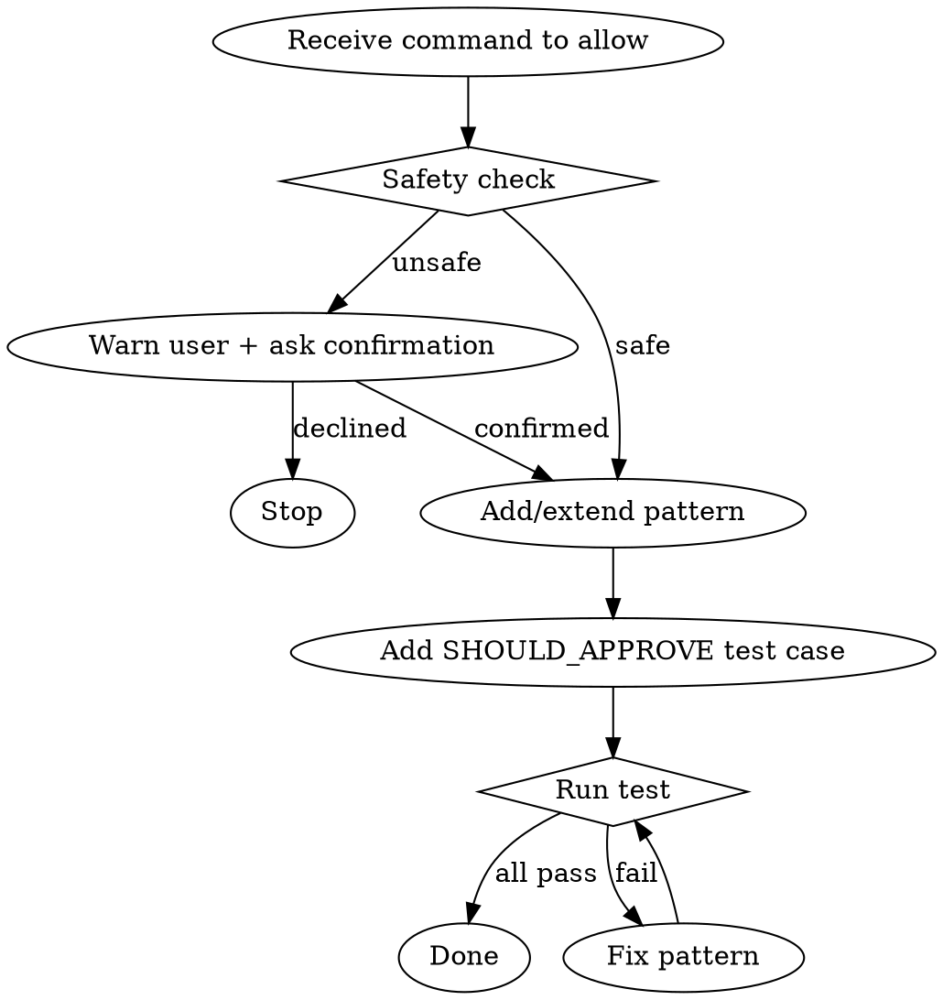

# pre-use-allow

Adds a new command pattern to the bash auto-approval hook, with a safety check and a passing test.

## Files

- `.claude/hooks/approve-commands-patterns.js` — all patterns (single source of truth)
- `.claude/hooks/approve-commands.js` — hook entry point (imports patterns, do not edit patterns here)
- `.claude/hooks/approve-commands.test.js` — test suite (imports same patterns)

## Workflow



## Step 1 — Safety Check

Before touching any file, assess whether the command is safe to auto-approve.

**Unsafe if any of these apply:**
- Destructive filesystem ops: `rm`, `mv`, `cp` with broad globs, `rmdir`
- Overwrites outside `/tmp` without project-path guard
- `git push --force`, `git reset --hard`, `git clean`
- Network calls that exfiltrate data: `curl … | bash`, `wget`
- `eval`, `exec`, backtick execution
- `;` chains where the second command is unsafe
- `sudo`, privilege escalation

If unsafe: **tell the user exactly what the risk is** (which part is dangerous and why), then ask for explicit confirmation before proceeding. Do not add the pattern if the user declines.

## Step 2 — Add or Extend Pattern in `approve-commands-patterns.js`

Open the file and decide:

- **New command family** → add a new `new RegExp(...)` entry with a comment
- **Variant of existing pattern** → widen the existing regex rather than duplicating

**Pattern conventions:**
- Use `^${P}` prefix (optional `cd <project> &&`) so bare and prefixed forms both match
- Use the `'s'` flag when the command can span multiple lines (heredocs)
- Block `;` injection in read-only patterns with `[^;\\n]*$` instead of `.*`
- Block `>` redirection in read-only patterns: `(?:[^>;\\n]|"[^"\\n]*")*$`
- Block `--force` with a negative lookahead: `(?!.*--force)`

**Example — adding a new family:**
```js
// git switch / checkout branch
new RegExp(`^${P}git (?:switch|checkout) (?!--(?:theirs|ours))[^;\\n]*$`),
```

## Step 3 — Add Test Case to `approve-commands.test.js`

Add the exact command (or a representative form of it) to the `SHOULD_APPROVE` array:

```js
['git switch — bare', 'git switch feature/foo'],
['git switch — with cd', 'cd /e/projects/ImageUncovered && git switch main'],
```

If the command has a dangerous variant that should still be rejected, add it to `SHOULD_REJECT` too.

## Step 4 — Run Tests Until Green

```bash
node .claude/hooks/approve-commands.test.js
```

Repeat fix → run until output ends with `N tests — N passed, 0 failed`.

**Common failures and fixes:**

| Symptom | Fix |
|---|---|
| SHOULD_APPROVE fails | Pattern too strict — broaden regex or add `'s'` flag |
| SHOULD_REJECT fails (approved when shouldn't) | Pattern too broad — add negative lookahead or anchor |
| `;` injection passes | Missing `[^;\\n]*$` on read-only pattern |
| Heredoc not matched | Missing `'s'` flag |
| `--force` variant approved | Missing `(?!.*--force)` lookahead |

## Quick Reference

| Goal | Regex ingredient |
|---|---|
| Optional cd prefix | `^${P}` |
| Multi-line (heredoc) | `'s'` flag |
| Block `;` injection | `[^;\\n]*$` |
| Block `>` redirect | `(?:[^>;\\n]\|"[^"\\n]*")*$` |
| Block `--force` | `(?!.*--force)` |
| Block `--hard` | `(?!.*--hard)` |
