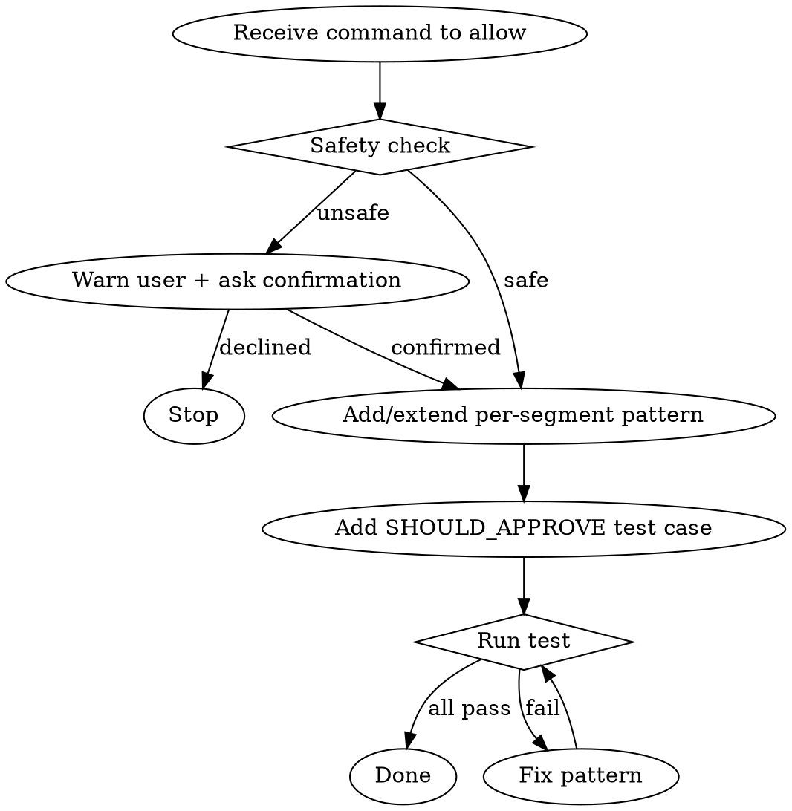

# pre-use-allow

Adds a new command pattern to the bash auto-approval hook, with a safety check and a passing test.

## How the hook decides (read this first)

The hook does NOT match the full command string with a single regex. Instead:

1. The parser in `approve-commands-core.js` splits the bash command into **segments** (separated by `&&`, `||`, `;`) and each segment into **pipe components** (separated by `|`). It respects quotes and escapes.
2. The parser **rejects up front** unsafe shell constructs anywhere outside quotes: `$(...)`, backticks, `<<` heredocs, `>` / `<` redirects, single `&` background, `()` subshells, `{}` groups, control flow, and unterminated quotes.
3. Each pipe component is then matched against the **per-segment patterns** in `approve-commands-patterns.js`. The full command is approved only if **every** pipe component of **every** sequence segment matches at least one pattern.

This means your patterns only describe a single bare command. The parser handles all the shell structure. You can no longer accidentally widen a pattern to swallow `&&` or `;` injections — they are split out and each part is checked independently.

## Files

Since 0.6.0 the hook is served by the plugin; a project owns only its patterns.

**In the project (what you edit):**
- `.claude/pre-use-allow/patterns.js` — `segmentPatterns: RegExp[]`, the single source of truth for what is allowed.
- `.claude/pre-use-allow/patterns.test.js` — the project's allow/deny boundary tests.

**In the plugin (do not edit from a user project):**
- `hooks/approve-commands-core.js` — parser + decision logic.
- `hooks/approve-commands.js` — PreToolUse entry point, registered via `hooks/hooks.json`.

**Pre-0.6.0 projects** still have the whole scaffold under `.claude/hooks/`. While
`.claude/hooks/approve-commands.js` exists the plugin hook stands down, so edit
`.claude/hooks/approve-commands-patterns.js` there and run `.claude/hooks/approve-commands.test.js`.
Offer `/pre-use-allow:pre-use-allow-init` to migrate — especially if the file exports the pre-0.4.0
`APPROVED_PATTERNS`, which blocks `;` but **not** `&&`.

## Workflow



## Step 1 — Safety check

Before touching any file, assess whether the command is safe to auto-approve. Note: the parser already blocks `$(...)`, backticks, redirects, heredocs, background, subshells, and operator-injected chains. Your job is to assess the *verb itself*.

**Unsafe if any of these apply:**
- Destructive filesystem ops: `rm`, `rmdir`, broad-glob `mv` / `cp`
- Anything that writes outside `/tmp` without a project-path guard
- `git push --force`, `git reset --hard`, `git clean -fd`
- Network calls that can exfiltrate data: `curl`, `wget` to arbitrary URLs
- `npm publish`, `npm uninstall`, `npm install` of arbitrary remote packages
- `sudo`, privilege escalation
- `eval`, `node -e "..."` with arbitrary code

If unsafe: **tell the user exactly what the risk is** (which part is dangerous and why), then ask for explicit confirmation before proceeding. Do not add the pattern if the user declines.

## Step 2 — Split the request into per-segment patterns

A request like `разреши cd "E:\proj" && git status && git diff` is **three** segments. You add a pattern per distinct bare command:

- `cd` segment → covered once by the project's `cd` pattern (already in defaults).
- `git status` → covered by the `git (status|log|diff|show)` pattern.
- `git diff ...` → same pattern.

If a needed pattern is missing, add it. If an existing pattern almost covers it, widen the alternation rather than duplicating.

**Pattern conventions:**
- Match a **single** bare command — no `&&`, `;`, `|`, `>`, `$(...)`, backticks. The parser handles those.
- Anchor with `^` and `$`.
- Restrict argument shapes. `\S+` is fine for path-like args; for branches / refs / messages, prefer specific character classes.
- For paths that may contain spaces, accept quoted forms: `(?:"[^"\n]+"|'[^'\n]+'|\S+)`.
- For commands that legitimately accept a free-form message via `-m`, accept double-quoted text: `-m "[^"\n]+"`.
- Avoid `.*` and `(?:.*)`. Be specific about what's allowed inside an argument.

**Example — adding a new family:**
```js
// docker read-only verbs
/^docker (?:ps|info|context|images|logs)(?:\s+\S+)*$/,
```

**Example — widening an existing one:**
```js
// before
/^git (?:status|log|diff|show)(?:\s+\S+)*$/,
// after (added `branch`, `remote`)
/^git (?:status|log|diff|show|branch|remote)(?:\s+\S+)*$/,
```

## Step 3 — Add a test case

In the project's `patterns.test.js` (pre-0.6.0: `approve-commands.test.js`), add the
**representative** command form to `SHOULD_APPROVE`:

```js
['docker ps -a', 'docker ps -a'],
['cd && docker ps', 'cd /tmp && docker ps'],
```

When the new pattern has a dangerous near-neighbour (e.g. `docker rm`), add it to `SHOULD_REJECT` to lock the boundary:

```js
['docker rm — must reject', 'docker rm my-container'],
```

You don't need to add tests for shell-injection variants of your new verb — `git status && rm`, `git status | sh`, `git status > /tmp/leak`, etc. are already covered by the core suite once and apply to every pattern.

## Step 4 — Run tests until green

```bash
node .claude/pre-use-allow/patterns.test.js      # 0.6.0+
node .claude/hooks/approve-commands.test.js      # pre-0.6.0 projects
```

Repeat fix → run until output ends with `N tests — N passed, 0 failed`.

**Common failures and fixes:**

| Symptom | Fix |
|---|---|
| SHOULD_APPROVE fails for `cd X && cmd` | The `cmd` segment doesn't match. Don't try to include `cd` in the pattern — both segments are matched independently. Make sure `cd` and the second verb each have a matching pattern. |
| SHOULD_APPROVE fails for `cmd "..."` | Pattern doesn't accept the quoted argument shape. Add a `"[^"\n]+"` alternative. |
| SHOULD_REJECT fails (your pattern is over-broad) | Tighten with explicit alternation instead of `\S+`, or add anchors around safe sub-shapes. |
| New verb works but a `cmd1 && cmd2` chain still rejected | `cmd2` isn't in any pattern. Add it (or this command shouldn't be auto-approved). |

## What you no longer need to worry about

These used to live in patterns; they now live in the parser and are tested centrally:

- `;` injection
- `&&` injection (the old hole this skill was rewritten to fix)
- `|` injection
- `$(...)` and backticks
- heredocs (`<<EOF`) and here-strings (`<<<`)
- background `&`
- redirects to real files (`> file`, `>> file`, `< file`, `2> file`, `&> file`)

You should not add `[^;\\n]*$` style guards to your patterns — they're dead weight now.

## Safe redirect carve-outs

The parser **does** allow two specific redirect families because they are not
disk writes and are commonly used in diagnostic pipelines:

- **FD duplication**: `2>&1`, `1>&2`, `>&2`, `<&0`, etc. — duplicates one file
  descriptor onto another. No file is created.
- **Null sink**: `> /dev/null`, `2> /dev/null`, `&> /dev/null` (with or without
  whitespace before `/dev/null`).

The parser consumes the redirect specifier and removes any leading `1` or `2`
file-descriptor digit from the buffer, so your pattern sees the bare command.
That is: `npm test 2>&1 | tail -40` parses to `[['npm test', 'tail -40']]`
and your `^npm test...$` pattern still matches.

Forms that **remain rejected**:
- `> file`, `>> file`, `< file` to anything that isn't `/dev/null`
- `<<EOF`, `<<<string`
- `&>> file` (append form of &>)

## Quick reference

| Goal | Pattern shape |
|---|---|
| Single bare command, no args | `/^npm ci$/` |
| Bare command + free-form args | `/^npm test(?:\s+\S+)*$/` |
| Subcommand alternation | `/^git (?:status\|log\|diff\|show)(?:\s+\S+)*$/` |
| Path argument (quoted or bare) | `/^cd (?:"[^"\n]+"\|'[^'\n]+'\|\S+)$/` |
| Free-form `-m "..."` message | `/^git commit -m "[^"\n]+"$/` |
